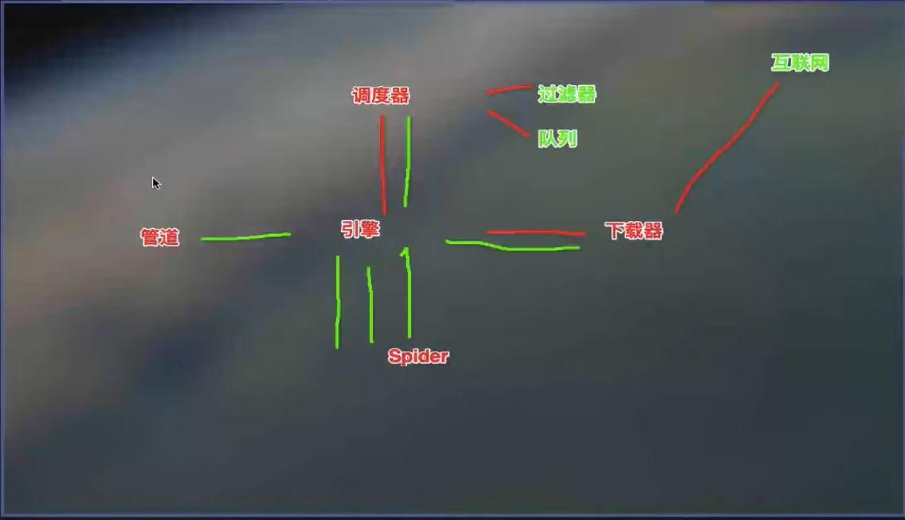

# 爬虫基础

## 概念

### 爬虫

- 通过编写程序，**模拟**浏览器上网，让其去**抓取**互联网上数据


# 合法性

## 合法性

- 在法律中不被禁止
- 具有违法风险
  - 善意爬虫：
  - 恶意爬虫：干扰了被访问网站的正常运营；抓取到了受到法律保护的特定类型的数据或信息

### 避免风险

- 优化自己的程序，避免干扰访问网站的正常运行
- 传播爬取到的数据时，审查抓取到的内容，涉及到商业机密等敏感内容时需要及时停止爬取或传播


## 分类

### 通用爬虫

- 搜索引擎的抓取系统的重要组成部分

### 聚焦爬虫

- 建立在通用爬虫的基础上，抓取页面中特定的局部内容

### 增量式爬虫

- 监测网站中数据更新的情况，只会抓取网站中最新更新的数据


## 矛与盾

### 反爬机制

- 通过制定相应的策略或技术手段，防止爬虫程序进行数据的爬取

### 反反爬策略

- 爬虫程序通过制定相关的策略或技术手段，破解反爬机制


## robots.txt协议

- 君子协议，规定了网站中不能被爬虫爬取的数据


## http和https协议

- 概念：服务器与客户端进行数据交互的一种形式

- 请求头信息：
  - User-Agent：请求载体的身份标识
  - Connection：请求完毕后是否保持连接(closed, keep alive)

- 响应头信息：
  - Content-Type：服务器响应回客户端的数据类型

- https协议

  - 安全的超文本传输协议

  - 加密方式
    - 对称密钥加密：密钥和密文一同传输
    - 非对称密钥加密：制定公钥和私钥，先将公钥发送给客户端(效率低；无法保证客户端拿到的是服务器端的公钥)
    - 证书密钥加密：证书认证机构对公钥进行签名


# requests模块

::: urllib模块出现较早，可以被更高效的requests模块替代

## requests模块

- python中原生的基于网络请求的模块
- 作用：模拟浏览器发送请求


## 浏览器请求过程(requests模块的编码流程)

- 指定url

  > requests中会自动对url进行编码

- UA伪装

- 发起请求

- 获取响应数据

- 数据解析

- 持久化存储


## 环境安装

``` 
pip install request
```


## UA伪装

- UA检测：网站服务器可能基于身份标识进行检测

- UA伪装：让爬虫的身份标识伪装为浏览器


## 动态页面

- 使用AJAX，ASP，JSP等动态网页技术实现网页的局部加载或刷新(一般通过抓包获取交换的JSON数据)

  > 标签也可以动态加载

- 检测：

  - 对url发请求，查看是否缺失部分数据
  - 抓包工具查看是否有动态请求
  - 浏览网页是否有局部刷新

- 提取：

  - 直接抓包
  - 用正则解析html中的js等源码


## Json串

- 动态刷新的内容一般为Json串，可以使用`response.json()`获取

- json.dump()

  将字典类型的数据以Json格式存入文件

  ```python
  import json
  
  json.dump(dict_obj,file,ensure_ascii)
  ```

  - dict_obj：字典类型的数据
  - file：打开的文件描述符
  - ensure_ascii：默认为True，对于非ASCII码，需要设置为False


## 浏览器抓包

- 一般F12进入浏览器抓包，Elements为网页源码数据，Network为数据包
- Network中XHR表示动态请求，可以查询到GET/POST方法，请求的url，参数，响应数据格式(Content-Type)，响应数据

- Content-Type：
  - text/plain：字符串
  - application/json：json格式


## 分页爬取

- 根据页数找出url规律


## 编码格式

- requests库会基于http头部中Content-Type对响应的编码进行推测，其中的charset决定了编码方式，如果未指定，Content-Type默认为text/html

- 可以使用chardet库推测编码格式

  ```python
  chardet.detect(raw_data)
  ```

- 可以通过修改response的encoding属性进行修改

  ```python
  response.encoding = chardet.detect(response.content)
  ```


> 通用中文乱码：
>
> 1.整体设置为utf-8
>
> 2.
>
> ```python
> str.encode('iso-8859-1').decode('gbk')
> ```


## 常用方法

- requests.get()

  对指定url发起get请求，在请求过程中会自动对参数进行处理

  ```python
  requests.get(url,params,headers)
  ```

  - url：发起请求的url(字符串，可以直接带参数)
  - params：url携带的参数(字典)
  - headers：所使用的头信息(字典)

- requests.post()

  对指定url发起post请求

  ```python
  requests.pose(url,data,headers)
  ```

  - url：post请求的url(字符串)
  - data：请求的参数(字典)

  - headers：所使用的头信息(字典)

- 响应对象

  post或get方法返回的对象

  ```python
  response.text # 获取字符串类型的响应数据
  response.json() # 获取Json类型的响应数据，生成字典
  response.content # 获取二进制形式的响应数据
  ```


# 数据解析

## 分类

- 正则
- bs4
- ***xpath***


## 原理

-  解析的局部文本内容都会在标签之间或标签的属性中存储
-  步骤：
   - 指定标签的定位
   - 标签或标签对应属性中存储的数据值进行提取


## 正则表达式

### 单字符

- . ：除换行符外的任意一个字符
- [] ：匹配集合中任意一个字符
- \d ：匹配一个数字
- \D ：匹配一个非数字
- \w ：匹配一个数字，字母，下划线，中文
- \W ：\w取反
- \s ：所有的空白字符，包括空格，制表符，换页符等。等价于[ \f\n\r\t\v]

### 数量修饰

- \* ：0或任意次
- \+ ：至少一次
- ? ：0或1次
- {m}：固定m次
- {m,} ：至少m次
- {m,n}：m-n次

### 边界

- $ ：匹配开头
- ^ ：匹配结尾

### 分组

- (ab)

### 贪婪模式

- 贪婪模式：.*
- 非贪婪模式：.*?

### 参数(拓展正则)

- re.I：忽略大小写
- re.M：多行匹配
- re.S：单行匹配

### re模块

- re.compile()

  生成正则表达式对象

  ```python
  regex = re.compile(pattern, flag)
  ```

  - pattern：正则表达式
  - flags：功能标志位，拓展正则表达式

- re.findall()

  返回匹配的列表内容

  ```python
  re.findall(pattern, string, flag)
  ```

- regex.findall()

  用正则表达式对象匹配字符串内容

  ```python
  regex.findall(string, pos, endpos)
  ```

  - pos，endpos：起始和结束的位置

- re.split()

  用正则表达式切割字符串，返回为列表

  ```python
  re.split(pattern, string, flag)
  ```

- re.sub()

  替换匹配到的内容

  ```python
  re.sub(pattern, replace, string, max, flag)
  ```

  - max：最多替换次数，默认为全部

- re.search()

  匹配第一个符合的内容，返回匹配对象

  ```python
  re.search(pattern, string, flag)
  ```


## bs4解析(python独有)

### 原理

bs4会将html文档转换为一个树形结构，每个节点对应一个标签或内容，对应一个python对象，可以分为4类：

- tag：所有html标签可以视为tag对象
- navigableString：字符串类，标签中的文本内容
- beautifulSoup：一个html文档的全部内容，根节点，特殊的tag对象
- comment：html中的注释和特殊字符串，特殊的navigableString

### 步骤新

- 实例化一个BeautifulSoup对象，并将页面源码加载到该对象中
- 通过调用BeautifulSoup对象的相关属性和方法进行数据提取

### 环境安装

```python
pip install bs4
pip install lxml
```

### BeautifulSoup

- 实例化

  - ```python
    soup = BeautifulSoup(fp, 'lxml')
    ```

    将本地的html文件加载到该对象中，使用lxml解析器

    fp：文件描述符

  - ```python
    soup = BeautifulSoup(response.text, 'lxml')
    ```

    将互联网获取的页面源码加载到该对象

- 方法和属性

  - soup.tagName

    获取第一次出现的tagName

  - soup.find()

    获取第一次出现的tagName

    ```python
    soup.find('tagName') # 等同于soup.tagName
    soup.find('tagName', attribute='') # 获取第一次具有固定属性的tagName
    ```

    - attribute：标签的属性，class需要写为class_

  - soup.find_all()

    获取所有tagName的标签内容列表

    ```python
    soup.findall('tagName') 
    ```

  - soup.select()

    返回符合选择器的标签列表

    ```python
    soup.select('selector') # 标签选择器
    ```

    - selector：某种选择器

    ```python
    .p1	# 类选择器，html中对应<p class="p1">
    #id	# id选择器，html中对应<p id="text">
    p	# 标签选择器，html中对应<p>
    p,a,li	# 分组选择器，一次选取多个标签
    duv ul li	# 后代选择器，选择包含在之前标签中的最后一个标签
    [name="pra1"]	# 属性选择器，如name，对应<p name="pra1">
    *	# 通用选择器
    p+a	# 兄弟选择器，选择同级的标签
    div>p	# 选择直属于div的p
    ```

  - soup.tagName.text/string/get_text()

    获取标签之间的文本数据

    > text/get_text()获取标签中所有的文本内容(包括子标签)，string只能获取直接属于该标签的文本

  - soup.tagName['attribute']

    获取对应标签的属性内容

## xpath

最常用且最便捷高效的一种解析方式，通用性最强

### 步骤

- 实例化一个etree的对象，且需要将页面源码加载到该对象中
- 调用etree对象中的xpath方法结合xpath表达式实现标签的定位和内容的捕获

### 环境安装

```python
pip install lxml
```

### etree

- 实例化对象

  ```python
  from lxml import etree
  etree.parse(filePath)	# 输入文件路径，返回一个etree对象
  etree.HTML(page_text)	# 输入html文本，返回一个etree对象
  ```

- xpath表达式

  ```python
  etree.xpath('xpath表达式')	# 返回符合表达式的列表
  lable.xpath('xpath表达式')	# 返回的标签对象也有xpath表达式方法，可以使用./来表示当前label下
  ```

  > xpath不可以匹配tbody标签

  根据层级关系，例如，html下的head下的title表示为/html/head/title

  - /：开始表示从根目录开始定位，后续表示一个层级
  - //：开始表示从任意位置开始定位，后续表示多个层级
  - [@attrName="attrValue"]：属性定位，跟在标签后，表示指定属性的标签
  - [n]：索引定位，跟在标签后，定位到第n个标签(从1开始)
  - 取文本：
    - /text()：取得直属于标签的文本
    - //text()：取得所有属于标签的文本，包括子标签
  - 取属性：
    - /@attrName：取得标签的特定属性值

  - 关系运算法：主要使用逻辑或 |

>  xpath返回都为列表，使用需要索引
>
>  xpath表达式可以在浏览器中直接生成


# 验证码识别

- 验证码是一种反爬机制

- 解决方法：
  - 人工肉眼识别
  - 第三方自动识别

- 流程：
  - 将验证码图片本地下载
  - 调用代码进行识别

> 注意验证码会改变，需要保证登陆时与识别的图片相同，单独请求会拿到另一张图片
>
> 截图是一个解决方法


# 模拟登陆

## 登陆

- 登陆一般会发送一个post请求，请求会携带登陆前录入的相关信息

- 一些网站在登陆后拿到的不一定会是页面源码，可以使用pose请求的响应状态码判断登陆是否成功

  ```python
  response.status_code	# 获取响应状态码，200为登陆成功
  ```

## cookie操作

- http/https协议特性：无状态
- cookie：用来让服务器端记录客户端的相关状态 
  - 手动cookie处理：手动写headers(处理麻烦，可能有有效时长)
  - 自动处理：一般cookie可以从post请求中获取

### session会话对象

- 可以进行请求的发送

- 如果请求中产生了cookie，则cookie会被存储在该session对象中

  ```python
  session = request.Session()	# 创建session对象
  session.post()	# 使用session进行post请求发送
  session.get()
  ```

## 代理

-  破解封ip的反爬机制
-  作用：
   - 突破自身IP访问的限制
   - 隐藏自身的IP

```python
proxy = {"https":""}	# 代理的ip字典，协议:地址
response = requests.get(url, proxies=proxy)	# 使用代理发送get请求
```

- 匿名度：
  - 透明：既知道使用了代理，也知道真实IP
  - 匿名：知道使用了代理，但不知道真实IP
  - 高匿：既不知道使用了代理，也不知道真实IP


# 异步爬虫

- 多线程，多进程(不建议)

  - 好处：可以为相关阻塞操作开启单独线程或进程
  - 弊端：无法无限制开启多线程或多进程

- 进程池，线程池(适当使用)：

  - 好处：降低系统对进程或线程创建和销毁的频率，降低系统的开销
  - 弊端：池中线程或进程的数量有上限(如果阻塞方法远大于池中线程数量，效果不明显)
  - 原则：线程池处理的是阻塞且耗时的操作(视频的下载，写入文件...)

  ```python
  from multiprocessing.dummy import Pool
  
  pool = Pool(4)	# 实例化一个线程池对象
  pool.map(method, list)	# 将列表中的元素交给方法进行处理
  pool.close()	# 关闭线程池
  pool.join()	# 主线程等待子线程结束
  ```

- 单线程+异步协程

  - event_loop：事件循环，可以将函数注册到事件循环上，当满足条件，函数就会被循环执行
  - coroutine：协程对象，可以将协程对象注册到时间循环中，其会被事件循环调用
    - async关键字可以定义一个方法，在调用时不会被立即执行，而是返回一个协程对象

  - task：任务，对协程对象的进一步封装，包含了任务的各个状态
  - future：代表将来执行或还没有执行的任务，实际和task没有本质区别(实现方式不同)
  - async：定义一个协程
  - await：挂起阻塞方法的执行

  ```python
  import asyncio	# 导入包
  
  async def request():	# 定义一个方法，调用时不会立即执行，而是返回一个协程对象
      pass
  
  c = request()	# 接收协程对象
  
  loop = asyncio.get_event_loop()	# 创建一个事件循环对象
  
  task1 = loop.create_task(c)	# 基于loop创建一个task任务对象
  							# pending表示待执行，finished表示已执行
  task2 = asyncio.ensure_future(c)	# 创建一个future任务对象
  
  def callback_func(task):	# 定义回调函数，默认会将任务对象作为参数传入
      task.result()	# 返回任务的结果，即任务方法的返回值
  task.add_done_callback(callback_func)	# 绑定回调函数，在任务执行完成后调用
  
  loop.run_until_complete(c)	# 将协程对象或任务对象注册到loop中，并启动循环
  ```

- 多任务协程

  ```python
  tasks = [task1, ...]	# 创建任务列表
  loop.run_until_complete(asyncio.wait(tasks))	# 不能将tasks直接传入
  ```

  > 在异步协程中出现了同步模块相关的代码，那么就无法实现异步
  >
  > time.sleep(2)  --> await asyncio.sleep(2)
  >
  > 遇到阻塞操作要用await手动挂起

- aiohttp

  在异步协程中出现了同步模块相关的代码，那么就无法实现异步，例如

  ```python
  time.sleep(2)  --> await asyncio.sleep(2)	# 遇到阻塞操作要用await手动挂起
  ```

  request库中请求是基于同步的，异步需要使用aiohttp库

  - 安装

    ```python
    pip install aiohttp
    ```

  - 使用

    ```python
    async with aiohttp.ClientSession() as session:
        async with await session.get (url) as response:	# 要用await手动挂起
            page_text = await response.text()	# text在此处为方法
            page_content = await response.read()	# read返回二进制形式的数据
            page_json = await response.json()	# 返回json对象
    ```

> 这里的get和post的proxy参数传入的为一个字符串而非字典


# Selenium模块

## 简介

### 作用

- 便捷地获取网站中动态加载的数据
- 便捷地实现模拟登陆

### 定义

- 基于浏览器自动化的一个模块

## 使用

### 安装

- ```python
  pip install selenium
  ```

- 下载一个浏览器的驱动程序

### 使用

```python
from selenium import webdriver
from selenium.webdriver.chrome.service import Service

s = Service(excutable_path='')
brow = webdriver.Chrome(service=s)	# 实例化一个
brow.get(url, headers, params, proxy)
brow.page_source	# 获取当前页面的源码

input = bro.find_..._by_...()	# 标签定位，根据...定位...
input.send_keys()	# 向标签输入值
button.cllick()	# 点击按钮
brow.back()	# 回退操作
brow.forward()	# 前进操作

brow.execute_script('window.scrollTo(0, document.body.scrollHeight)')	# 执行js代码，向下滚动一屏

brow.save_screenshot(img_path) # 对页面进行截图，img标签中有坐标和长宽信息
```

### 处理iframe+动作链

iframe标签包含一个子页面，无法直接使用find定位

```python
brow.switch_to.frame('iframe')	# 切换浏览器的作用域到iframe中

from selenium.webdriver import ActionChains	# 导入动作链的类
action = ActionChains(brow)	# 使用webdriver对象创建动作链对象
action.click_and_hold()	# 点击并保持
action.move_by_offset(x, y).perform()	# 拖动并立即执行
action.release()	# 释放动作链
```

### 使用无头浏览器

无可视化界面地打开网页(chrome, phantomJs...)

```python
from selenium.webdriver.chrome.options import Options

chrome_options = Options()
chrome_options.add_argument('--headless')
chrome_options.add_argument('--disable-gpu')

brow = webdriver.Chrome(service=s, chrome_options=chrome_options)
```

### 规避检测

```python
fromselenium.webdriver import ChromeOptions

option = ChromeOptions()
option.add_experimental_option('excludeSwitches', ['enable-automation'])
brow = webdriver.Chrome(service=s, option=option)
```


# scrapy框架

## 功能

- 高性能的持久化存储
- 异步的数据下载
- 高性能的数据解析
- 分布式

## 安装

```python
pip install scrapy
```

## 使用

### 工程指令

```shell
$ scrapy startproject xxx	# 创建一个scrapy工程
$ cd xxx	# 进入工程目录
$ scrapy genspider spiderName www.xxx.com	# 生成爬虫文件，指定名称和初始网址
$ scrapy crawl spiderName	# 执行特定爬虫
```

### 工程目录

- ./spiders/\*：放置爬虫文件
- ./settings.py：设置文件
- ./item.py：item对象文件
- ./pipelines.py：管道文件，处理item类型对象

### 爬虫文件

- 爬虫类：父类为scrapy.Spider

  - 属性：

    - name：爬虫文件的名称，已经设定

    - allowed_domains = [' ']：允许的域名，限定start_urls中哪些url可以被请求

    - start_urls = ['']：起始url列表，会被scrapy进行自动请求发送

      > 但一般allowed_domains一般注释不使用

  - 方法：

    - parse(self, response)：用于数据解析，在请求后调用

### 配置文件

- ROBOTSTXT_OBEY：是否遵从robots协议
- LOG_LEVEL：输出日志类型，'ERROR'等
- USER_AGENT：scrapy所使用的UA伪装
- ITEM_PIPELINES：字典，键为管道类名，值为管道优先级，越小优先级越高
- IMAGES_STORE：字符串，指定ImagePipeline存储图片的目录

### 数据解析

```python
def parse(self, response):
    selector_list = response.xpath('')	# 对响应对象使用xpath
    									# 返回的是Selector对象列表
    selector.extract()	# 调用selector对象extract方法提取，返回内容
    selector_list.extract()	# 对每个对象调用extract方法，返回仍为列表
    selector_list.extract_first()	# 若保证只有一个元素，对其解析
```

> scrapy中response.text获取html，response.body获取二进制

### 持久化存储

- 基于终端指令

  - 2要求：只能将parse方法的返回值存储到本地的特定类型的文件中

  ```shell
  $ scrapy crawl spiderName -o file	# 将解析的输出保存到文件
  ```

  - 文件类型只能为json，jsonlines，jl，csv，xml，marshal，pickle

- 基于管道

  - 流程：

    - 数据解析

    - 在item.py的item类中定义相关的属性

      ```python
      content = scrapy.Field()	# 使用方法封装属性
      ```

    - 将解析的数据封装存储到item类型的对象中

      ```python
      item = xxxItem()
      item['content'] = xxx	# 需要使用['']访问，不能用.
      ```

    - 将item类型的对象提交给管道进行持久化存储

      ```python
      yield item	# 使用yield进行异步返回
      ```

      修改pipelines.py中的process_item进行修改，进行存储

      ```python
      class xxxPipeline(object):
          fp = None
          def open_spider(self, spider):
          # 重写父类方法，只会在开始时调用一次，打开文件只需一次
          
          def process_item(self, item, spider):
             	xxx = item['author']
              
              # 返回的item会传递给次优先级的管道
              return item
          
          def close_spider(self,spider):
          # 只会在结束时调用一次，可以用于关闭文件
      ```

    - 在配置文件中开启管道

### 全站爬取

- 就将网站某板块下全部页码(分页)下的全部数据爬取

- 手动请求发送

  - 将所有页面的元素加入到start_urls中(不推荐)

  - 实现

    ```python
    yield parse(self, response):
        ...
        # 用新的url请求，并回调parse进行解析，为递归，需要退出条件
        yield scrapy.Request(url=new_url, callback=self.parse)
    ```

- CrawlSpider类：Spider的一个子类，用于全站数据爬取

  ```shell
  $ scrapy genspider -t crawl xxx www.xxx.com	# 基于cralSpicder创建爬虫文件
  ```

  ```python
  from scrapy.linkextractors import LinkExtractor
  from scrapy.spiders import CrawlSpider, Rule
  
  class TestSpider(CrawlSpider):
  	# 链接提取器
      link = LinkExtractor(allow=r'')	# allow指定规则，输入正则表达式
      # 规则解析器
      # follow决定是否对子页面也进行提取
      rules = (Rule(link, callback='parse_item', follow=False),)
  ```

  - 链接提取器：根据指定规则(allow参数的正则)进行指定链接的提取
  - 规则解析器：对链接提取器提取的链接进行制定规则(callback)的解析

### 请求传参

- 使用场景：解析的数据不在同一张页面中(深度爬取)

- 使用meta参数传送，使用meta方法接受

  ```python
  yield scrapy.Request(url, callback=self.parse1, meta=item)
  
  def parse1(self, response):
      item = response.meta['item']
  ```

### 图片爬取ImagesPipeline

- 对比

  - 字符串：只需要基于xpath解析且提交管道进行持久化存储
  - 图片：xpath解析出src属性值，还需单独对图片发送请求获取二进制数据

- 基于ImagesPipeline

  - 只需要解析出图片的地址，提交到管道，不需要传送二进制，管道会请求二进制数据并进行存储

  - 用IMAGES——STORE指定存储目录

    ```python
    from scrapy.pipelines.images import ImagesPipeline
    class YandeReDbPipeline(ImagesPipeline):
    
        # 重写父类方法，获取图片响应对象
        def get_media_requests(self, item, info):
            yield scrapy.Request(url=item['src'])
    
        # 重写父类方法，获取图片存储路径
        def file_path(self, request, response=None, info=None, *, item=None):
            imgName = request.url.split('/')[-1]
            yield imgName
    
        # 重写父类方法，返回item给下一个管道
        def item_completed(self, results, item, info):
            return item
    ```

- 图片懒加载

  - 使用src2伪属性，被拖动到可视区域，才会变为src进行加载
  - scrapy没有可视化，需要对伪属性进行解析

### 分布式爬虫

- 搭建一个分布式的机群，对一组资源进行分布联合爬取，提升爬虫效率

- 安装

  ```shell
  pip install scrapy-redis	# 原生scrapy不能实现分布式爬虫
  							# 组件可以实现调度器和管道的共享
  ```

- 实现流程

  - 修改爬虫文件

    - 导入模块，将爬虫类父类修改为RedisCrawlSpider

      ```python
      from scrapy_redis.spiders import RedisCrawlSpider
      ```

    - 注释start_urls和allowed_domains进行注释，加入redis_key='name'属性，表示可以被共享的调度器队列

    - 编写数据解析相关为操作

  - 修改配置文件

    - 指定可以被共享的管道

      ```python
      ITEM_PIPELINES = {
          'scrapy_redis.pipelines.RedisPipeline':400
      }
      ```

    - 指定调度器

      ```python
      DUPEFILTER_CLASS = 'scrapy_redis.dupefilter.RFPDupeFilter'	# 过滤器
      SCHEDULER = 'scrapy_redis.scheduler.Scheduler'	# 调度器
      SCHEDULER_PERSIST = True	# 是否持久化
      ```

  - redis相关配置：

    - 注释bind 127.0.0.1，否则其它客户端不能访问

    - 关闭保护模式：protected-mode no，否则其它客户端不能写数据

    - 开启redis服务

    - 指定redis服务器(默认为本机)

      ```python
      REDIS_HOST = 'ip'
      REDIS_PORT = port
      ```

  - 执行工程

    ```shell
    $ scrapy runspider xxx.py
    ```

  - 向调度器的队列放入一个起始url

    ```shell
    lpush redis_key www.xxx.com
    ```

### 增量式爬虫

- 可以使用redis的set，加入判断，根据返回值决定是否爬取

## 五大核心组件



### 过程

- Spider产生url，封装为请求对象，发送给引擎
- 引擎将请求对象传送给调度器
- 调度器首先使用过滤器对请求对象去重，再放到队列中，调度发送给引擎
- 引擎将请求对象给下载器
- 下载器进行下载，得到response传送给引擎
- 引擎将响应对象传送给Spider
- Spider对响应对象进行解析，产生管道对象传送给引擎
- 引擎将管道对象传送给管道
- 管道对管道对象的内容进行持久化存储

### Spider

- 对url封装为请求对象
- 对响应对象进行解析

### 调度器

- 对请求对象去重
- 对请求对象进行排队

### 下载器

>  twisted实现异步下载

- 对数据进行下载

### 管道

- 进行持久化存储

### 引擎

- 用于数据流处理
- 触发事务(对象实例化，调用方法)

> 根据收到的数据流判断触发的事务

### 中间件

- 爬虫中间件：引擎与Spider间

- 下载中间件：在引擎和下载间

  - 拦截请求：头信息(UA伪装)，代理ip

    > 配置文件中是基于全局的，但中间件中是对于每个请求

    - middlewares文件

      ```python
      # 下载中间件重写
      class MiddleproDownloaderMiddleware:
          @classmethod
          # 拦截请求
          def process_request(self, request, spider):
      		
              return None
      
          # 拦截异常
          def process_exception(self, request, exception, spider):
      
              pass
      ```

      在配置文件中设置DOWNLOADER__MIDDLEWARES使用下载中间件

  - 拦截响应：篡改响应数据或响应对象

    > 一般通过中间件拦截响应来处理动态加载问题

    ```python
        def process_response(self, request, response, spider):
            # 通过url指定request，通过request指定response
    
            if request.url in spider.url_list:
                # 五大板块的响应对象
                # 基于selemium获取动态响应对象替代原响应对象
                # selenium最好在爬虫对象中定义
                bro = spider.bro
                bro.get(request.url)
                time.sleep(3)
                page_text = bro.page_source
                new_response = HtmlResponse(url=request.url, body=page_text, encoding='utf-8', request=request)
                return new_response
            return response
    ```

